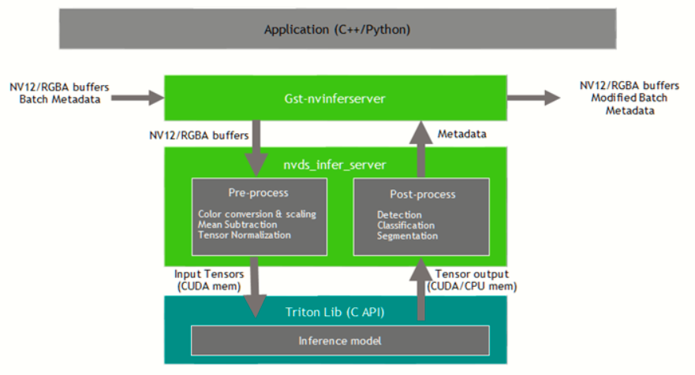
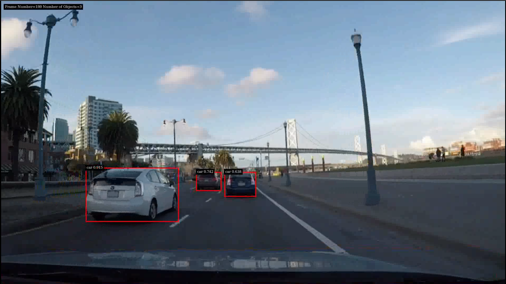

# YOLOv5 Deepstream 6.0

**Deepstream + Triton Inference Server + Yolov5 is awesome!!!**

Content table:
1. [Setup DeepStream Triton docker](#setup-deepstream-triton-docker)
2. [Build DeepStream Python API](#build-deepstream-python-api) 
3. [Triton model structure](#triton-model-structure)
4. [Run Video Inference](#run-video-inference)

## Setup Deepstream Triton Docker
THE FIRST, we need to NVIDIA Deepstream, Triton inference server. I suggest you use docker, this is easiest way if you never use before. 

We can also install [DeepStream](https://docs.nvidia.com/metropolis/deepstream/dev-guide/text/DS_Quickstart.html#dgpu-setup-for-ubuntu), [Triton Server](https://github.com/triton-inference-server/server) and run similar to.

Pull DeepStream Triton Docker:
```bash
docker pull nvcr.io/nvidia/deepstream:6.0-triton
```

## Build DeepStream Python API
Now, DeepStream supported python api. We can build inside Docker by [NVIDIA build deepstream python api tutorial](https://github.com/NVIDIA-AI-IOT/deepstream_python_apps/tree/master/bindings) or install directly **pyds** that built.

PyDS built inside DeepStream 6.0 Docker: [link](https://drive.google.com/file/d/1ZeEtzNIdNJvwopyBZwCNk7kjarTE2bsA/view?usp=sharing)

DeepStream Python API Reference: https://docs.nvidia.com/metropolis/deepstream/python-api/index.html

## Triton Model Structure
### Model repository
Triton Inference Server is interesting.
For use Triton, we need to model repository. [Model repository](https://github.com/triton-inference-server/server/blob/main/docs/model_repository.md#model-repository) is the directory where you place the models that you want Triton to serve. 
Triton model structure:
```
├── plugins
│   ├── libmyplugins.so
├── model_repository
│   ├── dali_yolov5_trt_prp
│   │   ├── 1
│   │   │   └── model.dali
│   │   └── config.pbtxt
│   ├── ensemble_dali_flag_trt
│   │   ├── 1
│   │   └── config.pbtxt
│   └── yolov5_flag_trt
│       ├── 1
│       │   └── model_flag.plan
│       └── config.pbtxt

```

### Build yolov5 tensorrt: 
https://github.com/wang-xinyu/tensorrtx/tree/master/yolov5

Or use directly:
- flag tensorrt built inside docker: [link](https://drive.google.com/file/d/1zHBqrup_FHYAX8l9r72UtE9VCf9HYPGg/view?usp=sharing)
- libmyplugins.so : [link](https://drive.google.com/file/d/1MVV96ao1LHXv53zOZPzejf8b1TWpIw7u/view?usp=sharing)
- dali yolov5 preprocess: [link](https://drive.google.com/file/d/17rOQzY7HOyoPnWPjCwn7N6QCPwQbBgVA/view?usp=sharing)

### Config file
[**yolov5_flag_trt** config file](./triton_server_config_file/yolov5_flag_trt_config.pbtxt)

[**ensemble_dali_flag_trt** config file](./triton_server_config_file/ensemble_dali_flag_trt_config.pbtxt)

[**dali_yolov5_trt_preprocess** config file](./triton_server_config_file/dali_yolov5_trt_preprocess_config.pbtxt)

## Run Video Inference 


This figure describe Deepstream Triton inference process.

**Note:**

- Config inference is [here](./deepstream_triton_yolov5_trt/ds_yolov5_trt_nopostprocess.txt)

- You can reference Triton inferserver at [here](https://docs.nvidia.com/metropolis/deepstream/dev-guide/text/DS_plugin_gst-nvinferserver.html)

### Run Docker
```
docker run --gpus "device=1" -it -v /path/to/model_repository:/models -v /path/to/plugins:/plugins --env LD_PRELOAD=path/to/plugins/libmyplugins.so -v /tmp/.X11-unix:/tmp/.X11-unix --name ds_triton_yolov5_trt  -e DISPLAY=$DISPLAY -w /opt/nvidia/deepstream/deepstream-6.0 nvcr.io/nvidia/deepstream:6.0-triton
```

### Install important packages
Inside docker, install packages:
```
root@9a4576858652:/opt/nvidia/deepstream/deepstream-6.0# apt update
root@9a4576858652:/opt/nvidia/deepstream/deepstream-6.0# apt install python3-gi python3-dev python3-gst-1.0 python-gi-dev git python-dev \
    python3 python3-pip python3.8-dev cmake g++ build-essential libglib2.0-dev \
    libglib2.0-dev-bin python-gi-dev libtool m4 autoconf automake 
```

install **pyds** directly
```
# copy pyds from local to inside docker 
docker cp <path/to/pyds-1.1.0-py3-none*.whl> 9a4576858652:/opt/nvidia/deepstream/deepstream-6.0/pyds-1.1.0-py3-none*.whl
```
after that,
```
root@9a4576858652:/opt/nvidia/deepstream/deepstream-6.0# pip3 install ./pyds-1.1.0-py3-none*.whl
```

### Testing Video Inference
Finally, run video inference inside docker.
```
cd sources
# clone repo
git clone -b restructure_ds_triton_yolov5 https://github.com/DNQuAng10/YOLOv5_Deepstream_6.0.git
cd YOLOv5_Deepstream_6.0/
# install python package
pip3 install -r requirements.txt
# Run 
cd deepstream_triton_yolov5_trt/
python3 deepstream_yolo_trt_parser.py --is_save
```


**helping:**
```
usage: deepstream_yolo_trt_parser.py [-h] [--test_video TEST_VIDEO] [--num_class NUM_CLASS] [--is_save] [--conf CONF]                                        [--iou IOU] [--outvid_width OUTVID_WIDTH] [--outvid_height OUTVID_HEIGHT]                                                                                                                                  Deepstream Triton Yolov5 PIPELINE                                                                                                                                                                                                               optional arguments:                                                                                                       -h, --help            show this help message and exit                                                                   --test_video TEST_VIDEO                                                                                                                       test video file path or uri                                                                       --num_class NUM_CLASS                                                                                                                         Number of object detection                                                                        --is_save             Save result video output                                                                          --conf CONF           Confidence threshold for YOLOv5                                                                   --iou IOU             IOU threshold                                                                                     --outvid_width OUTVID_WIDTH                                                                                                                   VIDEO OUTPUT WIDTH                                                                                --outvid_height OUTVID_HEIGHT                                                                                                                 VIDEO OUTPUT_HEIGHT
```

**See results in saved video output: ./ds_triton_yolov5_trt_out.mp4** by add `--is_save` argument.

If you want to experimental Deepstream + Triton DALI + yolov5 tensorrt inference, add `--is_dali` argument to command line. 


Result picture:


### test h264 video 
```
python3 deepstream_yolo_trt_parser.py --test_video <path/to/video.h264>
```

### test mp4 video 
```
python3 deepstream_yolo_trt_parser.py --test_video file:///path/to/video.mp4
```

### test URI video 
```
python3 deepstream_yolo_trt_parser.py --test_video https://uri_video.mp4
```

## [Reference](./reference.md)
